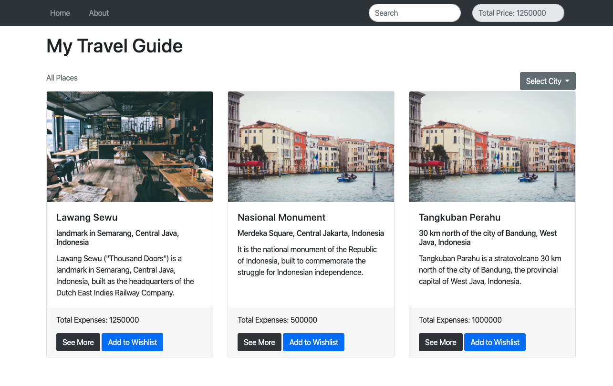
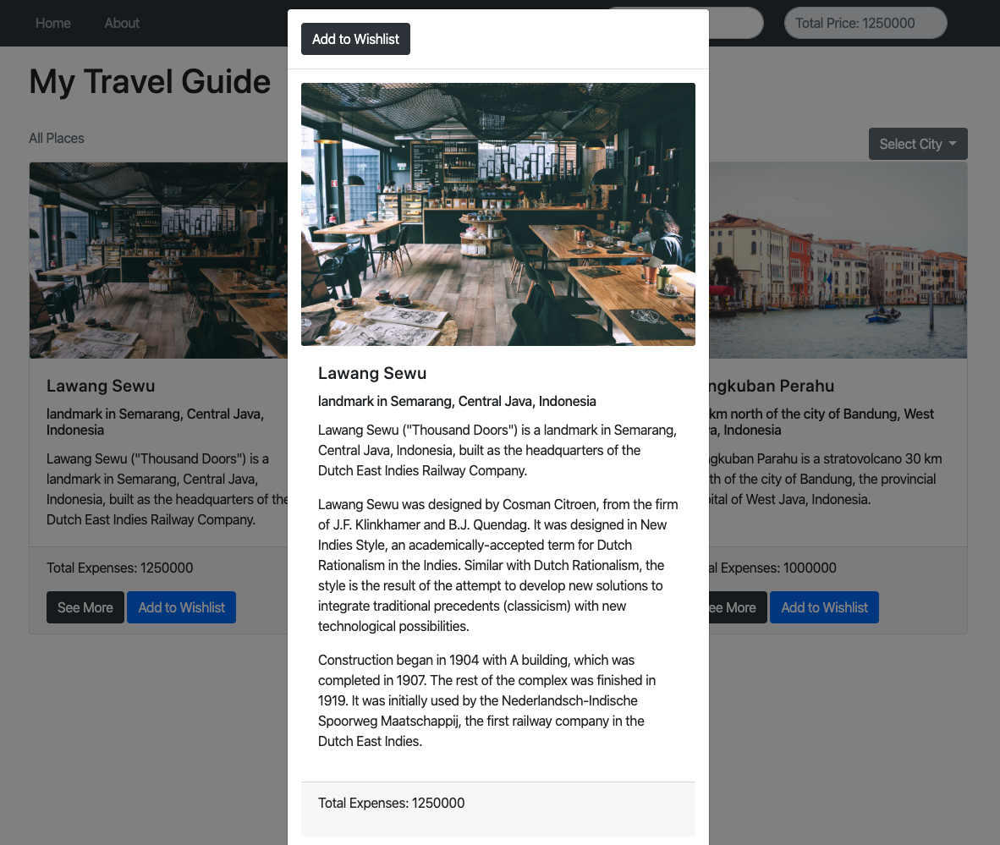

# Web Apps Project 1 // Travel Guide Website

## Projects Concepts

### Approaching a Project

Perencanaan yang baik akan menghasilkan output yang baik pula. Berikut adalah beberapa langkah yang patut diterapkan, saat  mengerjakan sebuah projek.

* Gambaran langkah-langkah yang diperlukan
* Visualisasikan aplikasi yang ingin kamu buat dalam bentuk gambar
  * Seperti apa page yang ingin kamu buat
  * Bagaimana transisi antar page yang ingin kamu kembangkan
* Kembangkan page secara sistematis, elemen demi elemen

Sebelum kamu submit projek:

* Usahakan hilangkan semua bugs
* Periksa kembali rubric dan pastikan projek kamu sesuai dengan kriteria

Lakukan dengan santai, serta kolaborasikan kemampuan yang baru kamu dapatkan! 🙌🏼

Jika kamu mengalami kendala, jangan ragu untuk menggunakan **mentor service**.

### Project Overview

Pada projek _Travel Guide Website_ ini, kamu akan membuat sebuah *landing page*.

1. *Landing page* ini nantinya dapat **menampilkan berbagai destinasi dan kota**
2. Lalu kamu dapat **melihat detail biaya untuk akomodasi ke destinasi tersebut**
3. Projek ini menitikberatkan penggunaan HTML untuk mengembangkan webpage, CSS untuk styling, serta JavaScript dan DOM untuk melihat destinasi dan kota termasuk biaya akomodasinya

#### Get the Project

Ada beberapa opsi untuk memulai projek ini, yaitu:

* forking dan cloning repository yang disedikan di Git (TBA)
* mulai dari 0 dengan membuat file sendiri

#### Starter Code

Jika kamu lebih suka menggunakan laptop pribadi, silahkan lakukan forking dan cloning starter repository.

**Kode yang terdapat dalam starter repository memiliki CSS dan markup HTML yang bisa digunakan, namun belum ada kode JS**. Cara ini dapat dimanfaatkan untuk menyelesaikan projek, jika kamu tidak mau membuat keseluruhan CSS dan HTML dari 0, maka cara ini dapat mempersingkat waktu. Kode yang tersedia akan mendemonstrasikan sebuah halaman HTML statis dari aplikasi yang kamu buat. Sebagai catatan, page tersebut tidak dapat mendemonstrasikan fungsi secara interaktif.

Kamu juga bisa menggunakan css framework seperti bootstrap untuk mempercantik tampilannya.

#### Starting from Scratch

**Jika kamu memilih untuk mengerjakan semuanya dari 0, kamu bisa mulai dengan membuat sendiri file index.html hingga file CSS dan JavaScript yang dibutuhkan.**

Kamu juga bisa menggunakan css framework seperti bootstrap untuk mempercantik tampilannya.

#### App Functionality

Halaman utama pada aplikasi ini menampilkan daftar destinasi (seperti Kota Tua, Bandungan, dll). Setiap destinasi harus memiliki:

* Judul destinasi
* Deskripsi
* Gambar destinasi
* Lokasi
* Biaya

Homepage dari aplikasi Travel Guide ini menunjukkan **judul dan semua daftar destinasi**, hingga **tombol drop down untuk memfilter dan menampilkan nama kota**. Kamu juga bisa menambahkan **search input untuk langsung mencari destinasi**. Landing page yang sudah selesai dibuat setidaknya terlihat seperti ini.

**Setiap destinasi memiliki keterkaitan dengan *Total Price* yang dapat menghitung biaya dari setiap destinasi yang dipilih.** Saat kamu memilih destinasi yang berbeda dengan menekan tombol “Add to Wishlist”, total biaya yang muncul akan bertambah sesuai dengan destinasi yang sudah dipilih. Sebagai catatan, default value dari total biaya adalah 0 apabila tidak ada destinasi yang dipilih.

Button *See More* akan memunculkan sebuah modal box, di mana detail seperti Judul Destinasi, Deskripsi, Gambar Destinasi, Lokasi, Biaya, dan tombol “Add to Wishlist” akan terlihat. Tombol “Add to Wishlist” juga akan menghitung total biaya. Tidak lupa dengan tombol Close untuk kembali ke homepage. Lebih detailnya seperti gambar di bawah ini.

Halaman utama juga memiliki search form, yang dapat mencari destinasi dan menambahkannya ke Wishlist.

Search form tersebut memiliki text input yang dapat digunakan untuk langsung menemukan destinasi. Saat value yang ada pada text input berubah, destinasi yang cocok dengan inputan tersebut akan muncul.  

#### Submission Requirements

Submission yang kamu ajukan harus berisikan semua file yang diperlukan, untuk menjalankan aplikasi web yang kamu buat pada sebuah browser. Reviewer akan menilai submission kamu, jika sudah sesuai dengan persyaratan.

#### Considerations

Fokus pada projek ini adalah penulisan fungsional HTML, CSS dan JS. Jadi, page yang indah bukanlah tujuan utama. Silahkan percantik layout HTML dan CSS jika kamu mau, namun **inti dari projek ini adalah fungsionalitasnya.**

### Project Instructions & Rubric

#### How will this project be evaluated

Projek kamu akan dievaluasi oleh Hacktiv8 Online Code Reviewer, sesuai dengan rubrik. Periksa kembali projek kamu sebelum disubmit. Semua kriteria harus sesuai dengan standar yang ditentukan agar dapat diterima.

Rubrik projek adalah satu-satunya sumber materi untuk membuat projek. Jangan lupa untuk menyimpannya ke bookmark browser sehingga dapat diakses dengan mudah.

#### Submission Instructions

Jika kamu memilih untuk menggunakan laptop/komputer pribadi, kamu harus:

Upload zip file kamu ke Hacktiv8 Online Program Projek submission.

### User Story

User story adalah deskripsi yang menjelaskan fungsionalitas aplikasi. Untuk melengkapi projek ini, kamu harus membangun sebuah aplikasi yang meliputi semua fungsionalitas dari user story di bawah ini.

**User Story \# 1** - My Travel Guide harus memiliki sebuah navbar dengan ID `navbar`.

**User Story \# 2** - Navbar tersebut harus memiliki search bar dan elemen yang menampung total biaya. Navbar tersebut juga harus berada di bagian atas landing page seperti ini:

**User Story \# 3** - Welcome section (header) harus memiliki elemen H1, di mana elemen ini berisikan teks yang menjadi judul (title) website.

**User Story \# 4** - My Travel Guide harus memiliki sebuah `<section>`, yang bernaman project section di mana project section ini menggunakan `class="card-deck"`.

**User Story \# 5** - Setiap destinasi dapat ditampilkan dengan card. Card Body harus memiliki elemen seperti Judul Destinasi di `class="card-title"` dan Deskripsi Destinasi di `class="card-text"`. Pada bagian `class="card-footer"` harus memiliki Total Biaya, Tombol Detail, dan Tombol Wishlist. Contohnya seperti berikut:

**User Story \# 6** - Berdasarkan gambar di atas, saat mengklik tombol ‘see more’, My Travel Guide harus menjalankan modal box yang berisikan Judul Destinasi, Deskripsi, Gambar Destinasi, Lokasi, Biaya, dan tombol ‘Add to Wishlist’.

**User Story \# 7** - Saat mengklik tombol `add to wishlist`, My Travel Guide harus mampu mengkalkulasi total biaya. Kalkulasi ini termasuk dalam total price element yang terletak pada ‘navbar’. Contohnya seperti ini:

**User Story \# 8** - My Travel Guide harus menampilkan destinasi yang benar ketika menginput destinasi pada search form.

**User Story \# 9** - My Travel Guide harus menampilkan biodata personal pada halaman ‘about’. Personal bio kamu harus memiliki gambar, deskripsi singkat, tabel berisikan pendidikan atau pengalaman kerja, serta form ‘contact us’ yang berhubungan dengan kamu.

**User Story \# 10** - Pada halaman ‘about’, form ‘contact us’ harus memiliki e-mail, nama, dan message. Tambahkan form validasi untuk contact page kamu. Semua form harus diisi, e-mail form harus memiliki format e-mail yang benar, serta message text input harus dibatasi sebanyak 200 karakter.

**User Story \# 11** - Pastikan landing page yang dibuat responsive. Artinya, jika ukuran layar berubah, landing page juga ikut menyesuaikan dengan perubahan layar tersebut.

**User Story \# 12** - Buatlah file README yang berisi bagaimana cara menggunakan landing page ini.

### Projects Submission

#### Project Submission Checklist

Sebelum submit projek kamu, cek ulang dan pastikan kamu mengerti poin-poin berikut ini:

* Saya yakin semua item rubrik yang ada telah sesuai persyaratan dan projek saya akan lolos untuk direview \(Jika tidak, saya akan berdiskusi dengan mentor sebelum men-submit\)
* Project dibuat dengan benar tanpa error
* Semua kebutuhan fungsional terpenuhi dan projek saya mampu berjalan sesuai dengan persyaratan yang ada

Jika semua hal di atas terpenuhi, projek kamu sudah bisa di-submit.

### Project Rubric

| Application Setup |  |
| :--- | :--- |
| CRITERIA | SPECIFICATIONS |
| Apakah aplikasi ini mudah diatur? | Aplikasi ini dibuat dengan CSS dan JS terpisah di setiap folder. Index.html adalah entry point menuju website. |
| Apakah aplikasi memiliki README dengan panduan instalasi dan penggunaan yang jelas? | README yang ter-update sudah termasuk pada aplikasi ini, dimana README ini menjelaskan projek, serta memberikan instruksi untuk me-maintain dan memodifikasi projek. |

| Main Page |  |
| :--- | :--- |
| CRITERIA | SPECIFICATIONS |
| Apakah main page menampilkan daftar destinasi? | Main page menampilkan daftar destinasi. Setiap destinasi memiliki konten yang tepat, serta judul dan tombol ‘to go’. |
| Apakah main page membolehkan user untuk bernavigasi ke berbagai tujuan? | Main page memiliki sebuah kontrol, yang membolehkan user untuk bernavigasi ke berbagai tujuan. Kontrol tersebut terikat ke setiap elemen destinasi. Fungsionalitas dari navigasi ini harus benar dan berjalan dengan baik. |
| Apakah main page responsif? | Main page menyesuaikan layout berdasarkan resolusi layar. Breakpoints yang disediakan CSS berjalan dengan baik. |
| Apakah code pada main page clean? | Tabulasi kode HTML pada main page sesuai dengan tag-nya. Tidak ada inline CSS dan \(external css and js only\). |
| Apakah kode CSS pada main page teroptimasi? | Ya, usahakan tidak ada kode styling yang tidak terpakai atau redudan. |

| Code Functionality |  |
| :--- | :--- |
| CRITERIA | SPECIFICATIONS |
| Apakah kode pada projek mampu mengakomodasi fungsi search dengan baik? | Setiap kali user mengetik pada search form, destinasi yang sesuai dengan ketikan tersebut akan ditampilkan di homepage. |
| Apakah kode pada projek mampu mengakomodasi fungsi add to wishlist dengan baik? | Saat user mengklik tombol wishlist, total biaya yang diperlukan untuk destinasi tersebut akan masuk ke kolom biaya. |
| Apakah total biaya destinasi sudah benar? | Total biaya destinasi adalah jumlah dari setiap destinasi yang berhasil ditambahkan dengan tombol add to wishlist. |
| Apakah detail destinasi menampilkan konten yang benar? | Halaman Detail Destinasi berisikan Judul Destinasi, Deskripsi, Gambar Destinasi, Lokasi, Biaya, dan tombol ‘add to wishlist’. |
| Apakah kode yang ada berjalan tanpa error? | Ya, kode yang ada dapat berjalan tanpa error. Tidak ada peringatan yang menunjukkan tanda error, karena daftar yang ada pada dokumentasi sudah termasuk best practice. Semua kode bersifat fungsional dan terformat dengan baik. |

| Skillset Checklist |
| :--- |
| CRITERIA |
| Mampu menulis HTML Tags |
| Mampu menulis CSS Syntax |
| Mampu mengoperasikan conditionals dasar |
| Mampu mengoperasikan loops dasar |
| Mampu mengoperasikan DOM Manipulation dasar |
