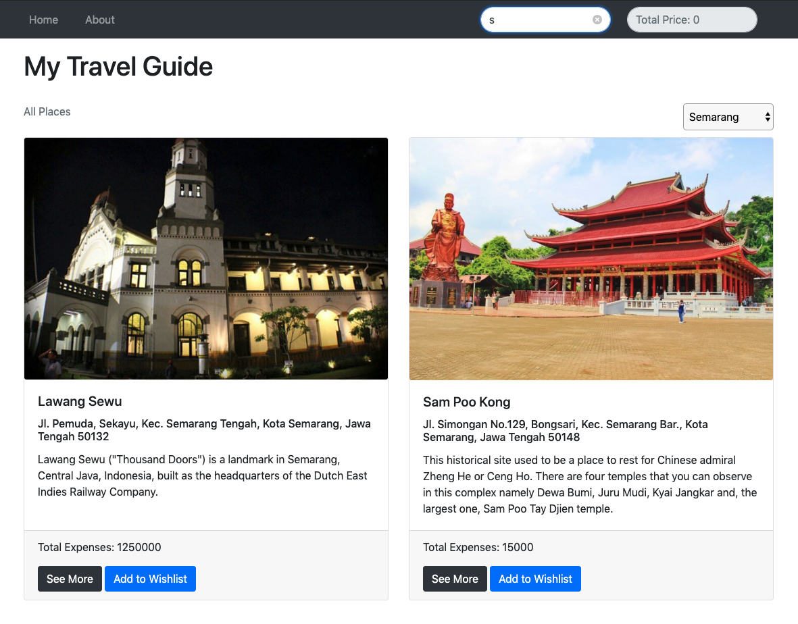
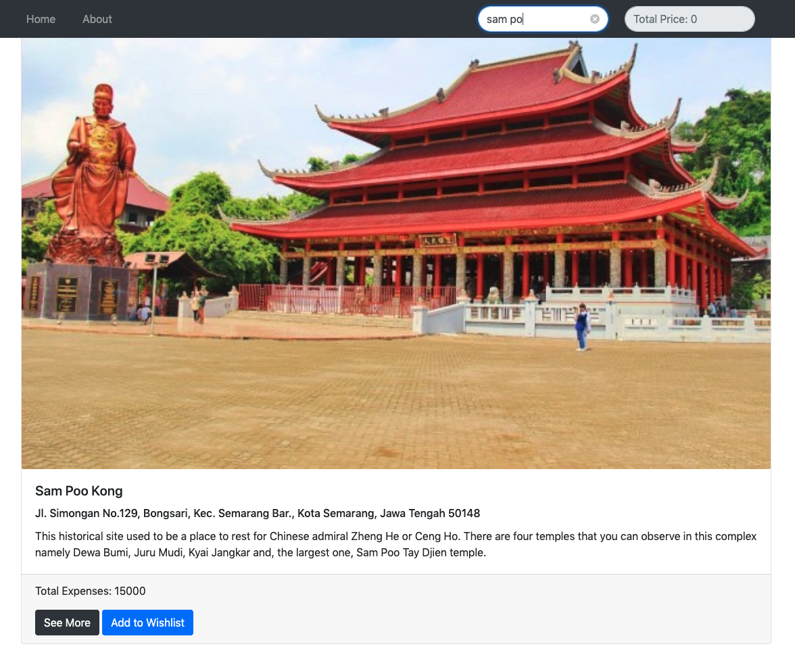

# Web Apps Project 1 // Travel Guide Website

## Projects Concepts

### Approaching a Project

Perencanaan yang baik akan menghasilkan output yang baik pula. Berikut adalah beberapa langkah yang patut diterapkan, saat  mengerjakan sebuah projek.

* Gambaran langkah-langkah yang diperlukan
* Visualisasikan aplikasi yang ingin kamu buat dalam bentuk gambar
  * Seperti apa page yang ingin kamu buat
  * Bagaimana transisi antar page yang ingin kamu kembangkan
* Kembangkan page secara sistematis, elemen demi elemen

Sebelum kamu submit projek:

* Usahakan hilangkan semua bugs
* Periksa kembali rubric dan pastikan projek kamu sesuai dengan kriteria

Lakukan dengan santai, serta kolaborasikan kemampuan yang baru kamu dapatkan! 🙌🏼

Jika kamu mengalami kendala, jangan ragu untuk menggunakan **mentor service**.

### Project Overview

Pada projek _Travel Guide Website_ ini, kamu akan membuat sebuah *landing page*.

1. *Landing page* ini nantinya dapat **menampilkan berbagai destinasi dan kota**
2. Lalu kamu dapat **melihat detail biaya untuk akomodasi ke destinasi tersebut**
3. Projek ini menitikberatkan penggunaan HTML untuk mengembangkan *webpage*, CSS untuk *styling*, serta JavaScript dan DOM untuk melihat destinasi dan kota termasuk biaya akomodasinya

#### Get the Project

Ada beberapa opsi untuk memulai projek ini, yaitu:

* *Forking* dan *cloning repository* yang disedikan di Git ([https://github.com/Fauzan-affan/travel-guide-website-template.git](https://github.com/Fauzan-affan/travel-guide-website-template.git))
* Mulai dari 0 dengan membuat *file* sendiri

#### Starter Code

Jika kamu lebih suka menggunakan laptop pribadi, silahkan lakukan *forking* dan *cloning starter repository*.

**Kode yang terdapat dalam *starter repository* memiliki CSS (Bootstrap CDN) dan markup HTML (Hello, world!) yang bisa digunakan, namun belum ada kode JS**. Kode yang tersedia akan mendemonstrasikan sebuah halaman HTML statis yang menampilkan tulisan `Hello, world!` dengan CDN Bootstrap di dalamnya. Sebagai catatan, *page* tersebut tidak dapat mendemonstrasikan fungsi secara interaktif.

#### Starting from Scratch

**Jika kamu memilih untuk mengerjakan semuanya dari 0, kamu bisa mulai dengan membuat sendiri file index.html hingga file CSS dan JavaScript yang dibutuhkan.**

Kamu juga bisa menggunakan CSS framework seperti bootstrap untuk mempercantik tampilannya.

#### App Functionality

Halaman utama pada aplikasi ini menampilkan daftar destinasi (seperti Kota Tua, Bandungan, dll) yang diambil dari JSON. Setiap destinasi harus memiliki:

* Judul destinasi
* Deskripsi
* Gambar destinasi
* Lokasi (kota)
* Biaya

Selain itu tambahkan juga:

* `id` untuk membedakan secara unik setiap destinasi yang ada

*Homepage* dari aplikasi *Travel Guide* ini menunjukkan:

1. **Judul dan semua daftar destinasi**
2. **Button *drop down* untuk memfilter dan menampilkan destinasi berdasarkan nama kota yang dipilih**
3. **Search input untuk langsung mencari destinasi**

***Landing page*** yang sudah selesai dibuat setidaknya terlihat seperti gambar di bawah ini:

* Setiap destinasi memiliki keterkaitan dengan *Total Price* (pojok kanan atas) yang dapat menghitung biaya dari setiap destinasi yang dipilih.

* Saat kamu memilih destinasi yang berbeda dengan menekan *button* **"Add to Wishlist"**, *Total Price* akan bertambah sesuai dengan destinasi yang sudah dipilih. Sebagai catatan, *default value* dari *Total Price* adalah 0 apabila tidak ada destinasi yang dipilih.

* Saat kamu menekan *button* **"See More"**, akan memunculkan sebuah *modal box*, di mana *detail* dari *modal box* adalah:

  1. Judul Destinasi
  2. Deskripsi
  3. Gambar Destinasi
  4. Lokasi (kota)
  5. Biaya
  6. *Button* **"Add to Wishlist"**
  
* *Button* **"Add to Wishlist"** di dalam modal juga akan dihitung *Total Price* ketika diklik.

* Tidak lupa dengan *button* **"close"** untuk kembali ke *homepage*.

Untuk ***modal box***, lebih detailnya seperti gambar di bawah ini:

* Halaman utama juga memiliki ***search form***, yang dapat mencari destinasi dan menambahkan harganya ke dalam *Total Price*, ketika *button* "Add to Wishlist" diklik.

* ***Search form* tersebut memiliki *text input*** yang dapat digunakan untuk langsung menemukan destinasi. Saat *value* yang ada pada *text input* berubah, destinasi yang cocok dengan inputan tersebut akan muncul.

Untuk ***search box***, lebih detailnya seperti gambar di bawah ini:

#### Submission Requirements

Submission projek yang kamu ajukan harus berisikan semua *file* yang diperlukan, untuk menjalankan aplikasi *web* yang kamu buat pada sebuah *browser*. *Reviewer* akan menilai *submission* kamu, jika sudah sesuai dengan persyaratan.

#### Considerations

Fokus pada projek ini adalah penulisan fungsional HTML, CSS dan JS. Jadi, *page* yang indah bukanlah tujuan utama. Silahkan percantik *layout* HTML dan CSS jika kamu mau, namun **inti dari projek ini adalah fungsionalitasnya.**

### Project Instructions & Rubric

#### How will this project be evaluated

Projek kamu akan dievaluasi oleh Hacktiv8 *Online Code Reviewer*, sesuai dengan rubrik. Periksa kembali projek kamu sebelum disubmit. Semua kriteria harus sesuai dengan standar yang ditentukan agar dapat diterima.

> Rubrik projek adalah satu-satunya sumber materi untuk membuat projek. Jangan lupa untuk menyimpannya ke ***bookmark browser*** sehingga dapat diakses dengan mudah.

#### Submission Instructions

Kamu harus:

* **Upload zip file kamu ke Hacktiv8 *Online Program Projek submission*** dengan **mengklik button upload project** seperti di bawah ini:

### User Story

*User story* adalah deskripsi yang menjelaskan fungsionalitas aplikasi. Untuk melengkapi projek ini, kamu harus membangun sebuah aplikasi yang meliputi semua fungsionalitas dari *user story* di bawah ini:

**User Story \# 1** - My Travel Guide harus memiliki sebuah navbar atau header.

**User Story \# 2** - Navbar tersebut harus memiliki **search bar** dan elemen yang menampung **total price**. Navbar tersebut juga harus berada di bagian atas landing page seperti ini:

**User Story \# 3** - Hero website (tulisan My Travel Guide di website) boleh memiliki elemen H1, di mana elemen ini berisikan teks yang menjadi judul (title) website.

**User Story \# 4** - My Travel Guide boleh memiliki sebuah `<section>`, yang digunakan untuk memecah beberapa bagian dari website seperti header section, hero section, body section, card section, dll.

**User Story \# 5** - Setiap destinasi dapat ditampilkan dengan card. Card Body harus memiliki elemen seperti Judul Destinasi di `class="card-title"` dan Deskripsi Destinasi di `class="card-text"`. Pada bagian `class="card-footer"` harus memiliki Total Expense, Button Detail (see more), dan button Wishlist (add to wishlist). Contohnya seperti berikut:

**User Story \# 6** - Berdasarkan gambar di atas, saat mengklik button "see more", My Travel Guide harus menjalankan modal box yang berisikan Judul Destinasi, Deskripsi, Gambar Destinasi, Lokasi, Biaya, dan button "Add to Wishlist".

**User Story \# 7** - Saat mengklik button "Add to wishlist", My Travel Guide harus mampu mengkalkulasi total biaya. Kalkulasi ini dimasukkan ke dalam total price element yang terletak pada navbar (pojok kanan atas). Contohnya seperti ini:

**User Story \# 8** - My Travel Guide harus menampilkan destinasi yang benar ketika text input pada search form diisi.

**User Story \# 9** - My Travel Guide mempunyai menu about yang menampilkan biodata personal pada halaman about (sifatnya opsional, about boleh ada atau tidak). Personal bio boleh memiliki gambar, deskripsi singkat, tabel berisikan pendidikan atau pengalaman kerja, serta form contact us yang berhubungan dengan kamu.

**User Story \# 10** - Pada halaman about, form contact us boleh memiliki e-mail, nama, dan message. Tambahkan form validasi untuk contact page kamu. Semua form boleh divalidasi, e-mail form boleh memiliki format e-mail yang benar, serta text input boleh dibatasi sebanyak 200 karakter.

**User Story \# 11** - Pastikan website dibuat responsive. Artinya, jika ukuran layar berubah, website juga ikut menyesuaikan dengan perubahan layar tersebut.

**User Story \# 12** - My Travel Guide website harus mempunyai file README yang berisi bagaimana cara menggunakan website ini.

### Projects Submission

#### Project Submission Checklist

> **Untuk bisa lulus di projek ini, kamu harus memenuhi minimal 8 dari 12 kriteria**

Sebelum submit projek kamu, cek ulang dan pastikan kamu mengerti poin-poin berikut ini:

* Saya yakin semua item rubrik yang ada telah sesuai persyaratan dan projek saya akan lolos untuk direview \(Jika tidak, saya akan berdiskusi dengan mentor sebelum men-submit\)
* Project dibuat dengan benar tanpa error
* Semua kebutuhan fungsional terpenuhi dan projek saya mampu berjalan sesuai dengan persyaratan yang ada

Jika semua hal di atas terpenuhi, projek kamu sudah bisa di-submit.

### Project Rubric

| Application Setup |  |
| :--- | :--- |
| CRITERIA | SPECIFICATIONS |
| Apakah aplikasi ini mudah diatur? | Aplikasi ini dibuat dengan CSS dan JS terpisah di setiap folder. Index.html adalah entry point menuju website. |
| Apakah aplikasi memiliki README dengan panduan instalasi dan penggunaan yang jelas? | README yang ter-update sudah termasuk pada aplikasi ini, dimana README ini menjelaskan projek, serta memberikan instruksi untuk me-maintain dan memodifikasi projek. |

| Main Page |  |
| :--- | :--- |
| CRITERIA | SPECIFICATIONS |
| Apakah main page menampilkan daftar destinasi? | Main page menampilkan daftar destinasi. Setiap destinasi memiliki konten yang tepat, serta judul, button "see more" dan button "add to wishlist". |
| Apakah main page membolehkan user untuk bernavigasi ke berbagai tujuan? | Main page memiliki sebuah dropdown, yang membolehkan user untuk bernavigasi ke berbagai tujuan. Dropdown tersebut terikat ke setiap elemen destinasi. Fungsionalitas dari navigasi ini harus benar dan berjalan dengan baik. |
| Apakah main page responsif? | Main page menyesuaikan layout berdasarkan resolusi layar. Breakpoints yang disediakan CSS berjalan dengan baik. |
| Apakah code pada main page clean? | Tabulasi kode HTML pada main page sesuai dengan tag-nya. Tidak ada inline CSS \(external css and js only\). |
| Apakah kode CSS pada main page teroptimasi? | Ya, usahakan tidak ada kode styling yang tidak terpakai atau redudan. |

| Code Functionality |  |
| :--- | :--- |
| CRITERIA | SPECIFICATIONS |
| Apakah kode pada projek mampu mengakomodasi fungsi search dengan baik? | Setiap kali user mengetik pada search form, destinasi yang sesuai dengan ketikan tersebut akan ditampilkan di homepage. |
| Apakah kode pada projek mampu mengakomodasi fungsi add to wishlist dengan baik? | Saat user mengklik button wishlist, total expense yang diperlukan untuk destinasi tersebut akan masuk ke kolom total price. |
| Apakah total price sudah benar? | Total price destinasi adalah jumlah dari setiap total expense destinasi yang berhasil ditambahkan dengan button add to wishlist. |
| Apakah detail destinasi menampilkan konten yang benar? | Halaman detail destinasi berisikan Judul Destinasi, Deskripsi, Gambar Destinasi, Lokasi, Biaya, dan button "add to wishlist". |
| Apakah kode yang ada berjalan tanpa error? | Ya, kode yang ada dapat berjalan tanpa error. Tidak ada peringatan yang menunjukkan tanda error, karena daftar yang ada pada dokumentasi sudah termasuk best practice. Semua kode bersifat fungsional dan terformat dengan baik. |

| Skillset Checklist |
| :--- |
| CRITERIA |
| Mampu menulis HTML Tags |
| Mampu menulis CSS Syntax |
| Mampu menggunakan Bootstrap |
| Mampu mengoperasikan conditionals dasar |
| Mampu mengoperasikan loops dasar |
| Mampu mengoperasikan DOM Manipulation dasar |
| Mampu memanipulasi JSON |
