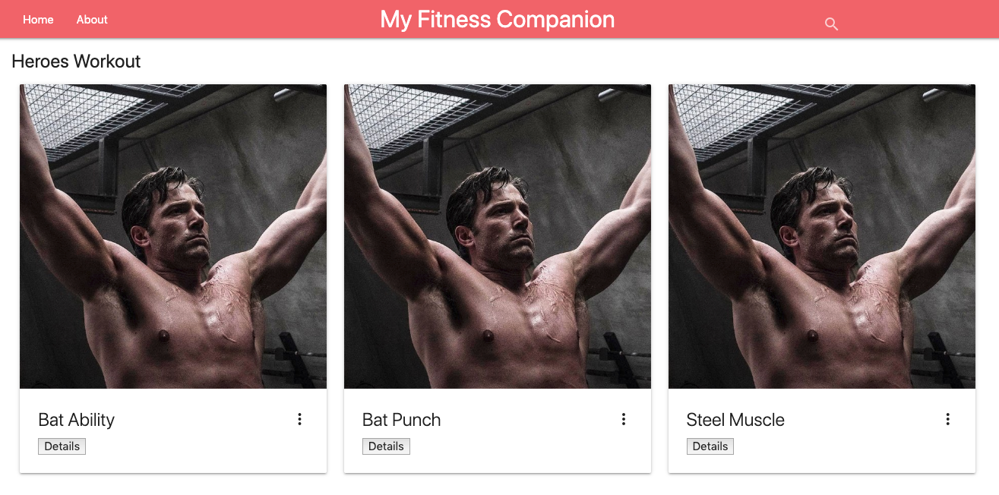
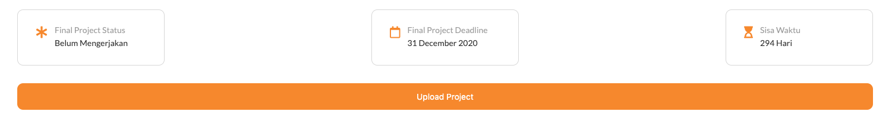

# Web Apps Project 3 // Fitness Companion Apps

## Projects Concepts

### Approaching a Project

Perencanaan yang baik akan menghasilkan output yang baik pula. Berikut adalah beberapa langkah yang patut diterapkan, saat  mengerjakan sebuah projek.

* Gambaran langkah-langkah yang diperlukan
* Visualisasikan aplikasi yang ingin kamu buat dalam bentuk gambar
  * Seperti apa page yang ingin kamu buat
  * Bagaimana transisi antar page yang ingin kamu kembangkan
* Kembangkan page secara sistematis, elemen demi elemen

Sebelum kamu submit projek:

* Usahakan hilangkan semua bugs
* Periksa kembali rubric dan pastikan projek kamu sesuai dengan kriteria

Lakukan dengan santai, serta kolaborasikan kemampuan yang baru kamu dapatkan! 🙌🏼

Jika kamu mengalami kendala, jangan ragu untuk menggunakan **mentor service**.

### Project Overview

Pada projek _Fitness Companion_ _Apps_.

1. Kamu akan membuat sebuah **aplikasi yang dapat mengatur workout harian**

2. **Menampilkan detail workout berdasarkan card yang tersedia**

3. Projek ini menitikberatkan **penggunaan Vue untuk memaintain aspek frontend dan Express untuk memaintain aspek backend** nya

#### Starting from Scratch

**Kerjakan semuanya dari 0, kamu bisa mulai dengan membuat server menggunakan express.js kemudian membuat project vue menggunakan vue CLI (recomended) atau CDN, serta menambahkan CSS dan JavaScript yang dibutuhkan.**

Kamu juga bisa menggunakan CSS framework seperti bootstrap untuk mempercantik tampilannya. Namun untuk bootsrap di vue menggunakan [vue boostrap component](https://bootstrap-vue.js.org/), berbeda dengan framework CSS bootstrap biasa.

Berikut adalah beberapa pilihan CSS framework untuk vue.js yang bisa digunakan:

* [Vuetify](https://vuetifyjs.com/en/)
* [Vue Bootstrap](https://bootstrap-vue.js.org/)
* [Vue Material](https://vuematerial.io/)
* [Vue Semantic UI](https://semantic-ui-vue.github.io/#/)
* [Vue Tailwind](https://vue-tailwind.com/)
* [Buefy](https://buefy.org/)

#### App Functionality

Dalam aplikasi ini, main page akan:

1. Menampilkan 2 card atau button untuk menuju ke Personal Workout dan Heroes Workout.

   Contohnya bisa dilihat seperti gambar di bawah ini:

   

    * **Personal Workout** adalah list workout yang diperuntukkan untuk user personal.

    * Sedangkan **Heroes Workout** adalah rangkaian workout yang tersedia dengan nama-nama superhero \(seperti Batman Workout yang berisikan: 20 squats, 40 punches, etc\).

2. Saat user mengakses **Personal Workout**, user mendapatkan tampilan seperti berikut:

    

    * User mendapatkan **daftar personal workout** yang data JSON-nya diambil dari backend menggunakan axios atau fetch API dan **checkbox pada setiap workout yang dapat di-checklist ketika workout sudah dikerjakan**.

3. Ketika user mengakses **Heroes Workout (Hero Workout)**, user mendapatkan tampilan seperti berikut:

    

    * ***Melihat daftar workouts yang sudah diatur (Heroes) dengan data berupa JSON yang diambil dari backend menggunakan axios atau fetch API**.

    * Setiap workout **berisikan gambar, judul workout, dan button "details"**.

    Ketika **button details diklik:**

    

    * Ketika button "details" diklik, akan **muncul judul dan daftar gerakan** yang harus dilakukan.

4. Halaman Heroes Workout juga memiliki **search form**, di mana search form ini berguna untuk mencari Heroes Workout tertentu dan melihat detailnya, seperti gambar di bawah ini:

    

    * Search form tersebut memiliki **text input yang dapat digunakan untuk langsung mem-filter workout**. Saat value yang ada pada text input berubah, workout yang cocok dengan inputan tersebut akan muncul.

#### Submission Requirements

Submission yang kamu ajukan harus berisikan semua file yang diperlukan, untuk menjalankan aplikasi web yang kamu buat pada sebuah browser. Reviewer akan menilai submission kamu, jika sudah sesuai dengan persyaratan.

#### Considerations

Fokus pada projek ini adalah penggunaan Vue dan Nodejs nya, jadi estetika proyek yang kamu buat bukan prioritas. Silahkan percantik layout HTML dan CSS jika kamu mau, namun **inti dari proyek ini adalah fungsionalitas**.

### Project Instructions & Rubric

#### How will this project be evaluated

Proyek kamu akan dievaluasi oleh Hacktiv8 *Online Code Reviewer*, sesuai dengan rubrik. Periksa kembali proyek kamu sebelum disubmit. Semua kriteria harus sesuai dengan standar yang ditentukan agar dapat diterima.

> Rubrik proyek adalah satu-satunya sumber materi untuk membuat projek. Jangan lupa untuk menyimpannya ke bookmark browser sehingga dapat diakses dengan mudah.

#### Submission Instructions

Kamu harus:

* **Upload zip file kamu ke Hacktiv8 *Online Program Projek submission*** dengan **mengklik button upload project** seperti di bawah ini:



### User Story

*User story* adalah deskripsi yang menjelaskan fungsionalitas aplikasi. Untuk melengkapi proyek ini, kamu harus membangun sebuah aplikasi yang meliputi semua fungsionalitas dari *user story* di bawah ini:

✨ **Expressjs (backend) User Story**\
**User Story \# 1** - My Fitness Companion **setidaknya** memiliki route berikut untuk Heroes pages: `/heroes`, `/heroes/:heroId`.

* Route GET `/heroes` digunakan untuk mengambil data dari JSON File heroesList.json.
* Route GET `/heroes/:heroId` digunakan untuk mengambil data spesifik berdasarkan ID dari JSON File heroesList.json. Route ini akan digunakan untuk mendapatkan workout detail dan menampilkan datanya menggunakan modal.

**User Story \# 2** - My Fitness Companion setidaknya memiliki route berikut untuk personal pages: `/personals`.

* Route GET `/personals` digunakan untuk mengambil data dari JSON File personalList.json.

**User Story \# 3** -  Aplikasi ini harus berjalan pada port 8080.

✨ **Vue (frontend) User Story**\
**User Story \# 1** - My Fitness Companion setidaknya memiliki sebuah komponen `Header.vue`, komponen `Body.vue`, komponen `PersonalWorkout.vue`, komponen `HeroWorkout.vue`, dan vue-router yang bertugas untuk mengatur komponen mana yang akan ditampilkan ketika suatu button diklik & menampilkan detail Heroes Workout mana sesuai card yang diklik.

**User Story \# 2** - Komponen `Header.vue` tersebut harus berada di bagian atas website. Komponen `Header.vue` juga berisi menu home dan about.

**User Story \# 3** - Komponen `Body.vue` **harus memiliki 2 card** yang masing-masing memiliki `<button>` untuk menuju ke Personal atau Hero Workout. **Button ini harus memiliki route yang dibuat menggunakan vue-router, untuk bernavigasi ke komponen `PersonalWorkout.vue` (jika personal yang diklik) maupun `HeroWorkout.vue` (jika heroes yang diklik).**

Contoh tampilan gabungan komponen `Header.vue` dan `Body.vue` nya adalah sebagai berikut:


**User Story \# 4** - Jika kamu ingin membuat isi dari menu about juga. Kamu bisa membuat komponen `About.vue`, komponen ini bisa berisi keterangan tentang website yang dibuat. Tapi ini tidak wajib.

**User Story \# 5** - Di dalam komponen `HeroWorkout.vue` buatlah *container* (bisa berupa elemen `<div>` yang diberikan class atau container bawaan dari css framework yang digunakan) untuk menampung semua card yang berisi workout. Selanjutnya:

1. **Container nantinya akan digunakan untuk menampung semua card Heroes Workout** yang ada terdapat pada JSON. Contoh container yang sudah diisikan semua card tampilannya akan seperti ini:

    

2. Kamu harus mem-fetch atau mengambil data Heroes Workout melalui API/URL yang telah dibuat di express.js menggunakan axios. Kemudian tampilkan seluruh isinya di container yang telah dibuat, menggunakan perulangan. Sehingga semua card akan otomatis tampil sebanyak data workout yang ada di dalam JSON. Contoh card yang ditembak ke dalam container > row menggunakan `v-for` dapat dilihat pada gambar di bawah ini:

    

    > Pada contoh di atas `v-for` menampilkan semua item yang tersimpan di dalam workout, yang sudah diisikan data dari API. Pastikan di dalam Vue sudah terdapat attribute dengan nama workout seperti ini `data: {workout: [],}` yang sudah diisikan data dari API juga

3. **Setiap data Heroes Workout ditampilkan dengan card** yang berisikan:

    * Nama workout
    * Deskripsi workout
    * Button **Details**

    Contoh tampilan gabungan komponen `Header.vue` dan `HeroWorkout.vue` (jika data hero workoutnya hanya ada 3, dengan title: Bat Ability, Bat Punch, dan Steel Muscle) adalah sebagai berikut:

    

4. Saat mengklik button **Details**, My Fitness Companion menampilkan ***popup modal box*** yang berisikan **Workout Title**, **deskripsi singkat workout**, dan **exercise data** melalui API berdasarkan ID menggunakan route `/heroes/:heroId`.

    Di bawah ini adalah contoh tampilan salah satu hero workout dengan popup modal berdasarkan ID ketika user mengklik details. Gambar di bawah ini memiliki:
    * **Workout title**: Green Smash
    * **Deskripsi singkat**: Dedicated to strength and dicipline building
    * **Exercise data**: Exercise, Warm Up, Working Sets, dan Rest Period (yang masing-masing ada 3 data di dalamnya)
    

    Contoh struktur json yang bisa digunakan untuk menampung datanya adalah sebagai berikut:

    ```json
    Heros: [
        {
            Id: 1,
            WorkoutTitle: "Green Smash",
            DeskripsiSingkat: "Dedicated to strength and dicipline building",
            ExcerciseData: [
            {
                Exercise: "Incline Barbell Bench Press",
                WarmUp: "2 x 10-15",
                WorkingSets: "3 x 4-8",
                RestPeriod: "2 min"
            },
            {
                Exercise: "Barbell Bench Press",
                WarmUp: "",
                WorkingSets: "3 x 4-8",
                RestPeriod: "2 min"
            },
            {
                Exercise: "Bent Over Barbell Row",
                WarmUp: "2 x 10-15",
                WorkingSets: "3 x 4-8",
                RestPeriod: "2 min"
            }]
        },
        {
            Id: 2
            ...
            ...
            ...
        }
    ]
    ```

    State di vue:

    ```json
    Data: {
        Heros: []
    }
    ```

5. **Menampilkan workout card yang benar, pada saat mengetik workout tertentu pada search form** di bagian atas dari komponen `HeroWorkout.vue`.

**User Story \# 7** - Komponen `PersonalWorkout.vue` harus memiliki:

1. File json dan state untuk menampung data sementara baik dari form atau dari API. Contoh struktur json yang bisa digunakan untuk menampung datanya adalah sebagai berikut:

    ```json
    Personals: [
        {
            Id: 1,
            Workout: "Incline Barbell Bench Press"
        },
        {
            Id: 2,
            Workout: "Barbell Bench Press"
        },
        {
            Id: ...,
            ...
            ...
            ...
        }
    ]
    ```

    State di vue:

    ```json
    Data: {
        Personals: []
    }
    ```

2. **Form dengan input text** untuk memasukkan workout baru ke data di json melalui API dengan route POST `/personals`, serta **button submit** untuk mengirim datanya.

3. **Memiliki `class="workoutList"`** untuk menampung semua data personal workout, yang di-fetch dari API dengan route GET `/personals`. Dan tampilkan semua datanya dengan menggunakan `v-for`.

    Di bawah ini adalah contoh tampilan dari gabungan komponen `Navbar.vue`, `Judul.vue`, dan `PersonalWorkout.vue`: 

4. Saat mengklik button submit (dalam gambar add), data baru dari input text harus ditampilkan pada bagian `class="workoutList"`.

5. Data yang baru pada list yang sudah ada, harus memiliki `key` yang sesuai dengan `Id` di file json. Sehingga, ketika salah satu workout list dicentang checkbox-nya, akan menampilkan data berdasarkan id menggunakan route GET `/personals/:personalId` ke input text dan **mengganti button submit menjadi button update, delete, dan close**.

    * Ketika button update diklik akan menjalankan route PUT `/personals/:personalId` untuk **mengupdate datanya berdasarkan id**
    * Ketika button delete diklik akan menjalankan route DELETE `/personals/:personalId` untuk **menghapus datanya berdasarkan id**
    * Ketika button close diklik **data tidak jadi dirubah** dan **kembali menampilkan button submit saja**

6. Workout baru yang ditambahkan harus diposisikan di atas workout lama, dengan increment ID baru berdasarkan ID terakhir. Ini bisa dilakukan dengan mengatur urutan ID berdasarkan ID terakhir (descanding).  

7. Setiap workout yang ditampilkan di workout list **harus memiliki checkbox**.

### Projects Submission

#### Instructions

Cek kembali apakah projek kamu sudah mengikuti style guideline kami terkait HTML, CSS, JavaScript dan Git.

Jika kamu memilih untuk menggunakan laptop/pc pribadi:

* Push projek kamu ke GitHub dan pastikan yang kamu push adalah master branch.
* Pada halaman project submission, pilih "Submit with GitHub"
* Tentukan repository untuk projek ini \(kemungkinan kamu perlu menghubungkan akun GitHub terlebih dulu\).

#### Project Submission Checklist

Sebelum submit proyek kamu, cek ulang dan pastikan kamu mengerti poin-poin berikut ini:

* Saya yakin semua item rubrik yang ada telah sesuai persyaratan dan proyek saya akan lolos untuk di-review \(Jika tidak, saya akan berdiskusi dengan mentor sebelum men-submit.\)
* Project dibuat dengan benar tanpa error.
* Semua kebutuhan fungsional terpenuhi dan projek saya mampu berjalan sesuai dengan persyaratan yang ada.

Jika semua hal di atas terpenuhi, projek kamu sudah bisa di-submit.

### Project Rubric

| Application Setup |  |
| :--- | :--- |
| CRITERIA | SPECIFICATIONS |
| Apakah aplikasi ini mudah diatur? | Aplikasi ini dibuat dengan CSS dan JS terpisah di setiap folder. Index.html adalah entry point menuju website. |
| Apakah aplikasi memiliki README dengan panduan instalasi dan penggunaan yang jelas? | README yang ter-update sudah termasuk pada aplikasi ini, di mana README ini menjelaskan proyek, serta memberikan instruksi untuk me-maintain dan memodifikasi proyek. |

| Personal Workout Page |  |
| :--- | :--- |
| CRITERIA | SPECIFICATIONS |
| Apakah halaman Personal Workout menampilkan form input? | Halaman Personal Workout menampilkan form, di mana form tersebut berbentuk workout input dan button add. |

| Heroes Workout Page |  |
| :--- | :--- |
| CRITERIA | SPECIFICATIONS |
| Apakah halaman Heroes menunjukkan daftar Heroes Workout? | The Heroes Page menunjukkan daftar semua workout. Setiap workout menunjukkan konten yang benar, title, dan button detail. |
| Apakah Heroes Page memiliki search bar? | Ya, search bar terletak di navigation bar (di bagian atas halaman). |

| Code Functionality |  |
| :--- | :--- |
| CRITERIA | SPECIFICATIONS |
| Apakah search berfungsi? | Fungsi search pada search bar bekerja saat user mengetik karakter apapun pada search bar. Di saat yang sama, workout yang muncul akan ter-filter sesuai dengan input tadi. |
| Apakah button detail pada Heroes Workout bekerja? | Button tersebut akan bekerja ketika ada interaksi yang menampilkan modal, di mana modal tersebut berisikan detail dari Heroes Workout. |
| Apakah add workout pada Personal Workout bekerja? | User dapat meng-input jenis-jenis workout di input form. Saat mengklik add, value baru akan muncul sesuai dengan input. |
| Apakah checkbox pada Personal Workout bekerja? | User dapat berinteraksi dengan checkbox di setiap workout pada halaman Personal Workout. Saat mengklik checkbox, font yang ada akan menjadi strikethrough. |
| Apakah halaman navigasi bekerja? | User dapat bernavigasi dari main page ke Personal ataupun Heroes Workout tanpa halangan. Proses tersebut dapat dilakukan secara terbalik. |
| Apakah kode yang ada berjalan tanpa error? | Ya, kode yang ada dapat berjalan tanpa error. Tidak ada peringatan yang menunjukkan tanda error, karena daftar yang ada pada dokumentasi sudah termasuk best practice. Semua kode bersifat fungsional dan terformat dengan baik. |
