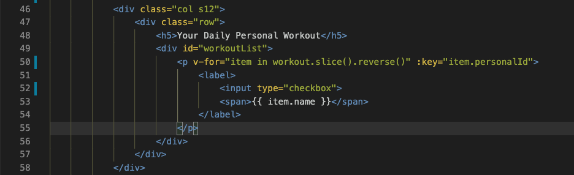

### User Story

_User story_ adalah deskripsi yang menjelaskan fungsionalitas aplikasi. Untuk melengkapi proyek ini, kamu harus membangun sebuah aplikasi yang meliputi semua fungsionalitas dari _user story_ di bawah ini:

✨ **Expressjs (backend) User Story**\
**User Story \# 1** - My Fitness Companion **setidaknya** memiliki route berikut untuk Heroes pages: `/heroes`, `/heroes/:heroId`.

- Route GET `/heroes` digunakan untuk mengambil data dari JSON File heroesList.json.
- Route GET `/heroes/:heroId` digunakan untuk mengambil data spesifik berdasarkan ID dari JSON File heroesList.json. Route ini akan digunakan untuk mendapatkan workout detail dan menampilkan datanya menggunakan modal.

**User Story \# 2** - My Fitness Companion setidaknya memiliki route berikut untuk personal pages: `/personals`.

- Route GET `/personals` digunakan untuk mengambil data dari JSON File personalList.json.

**User Story \# 3** - Aplikasi ini harus berjalan pada port 8080.

✨ **Vue (frontend) User Story**\
**User Story \# 1** - My Fitness Companion setidaknya memiliki sebuah komponen `Header.vue`, komponen `Body.vue`, komponen `PersonalWorkout.vue`, komponen `HeroWorkout.vue`, dan vue-router yang bertugas untuk mengatur komponen mana yang akan ditampilkan ketika suatu button diklik & menampilkan detail Heroes Workout mana sesuai card yang diklik.

**User Story \# 2** - Komponen `Header.vue` tersebut harus berada di bagian atas website. Komponen `Header.vue` juga berisi menu home dan about.

**User Story \# 3** - Komponen `Body.vue` **harus memiliki 2 card** yang masing-masing memiliki `<button>` untuk menuju ke Personal atau Hero Workout. **Button ini harus memiliki route yang dibuat menggunakan vue-router, untuk bernavigasi ke komponen `PersonalWorkout.vue` (jika personal yang diklik) maupun `HeroWorkout.vue` (jika heroes yang diklik).**

Contoh tampilan gabungan komponen `Header.vue` dan `Body.vue` nya adalah sebagai berikut:


**User Story \# 4** - Jika kamu ingin membuat isi dari menu about juga. Kamu bisa membuat komponen `About.vue`, komponen ini bisa berisi keterangan tentang website yang dibuat. Tapi ini tidak wajib.

**User Story \# 5** - Di dalam komponen `HeroWorkout.vue` buatlah _container_ (bisa berupa elemen `<div>` yang diberikan class atau container bawaan dari css framework yang digunakan) untuk menampung semua card yang berisi heroes workout. Selanjutnya:

1. **Container nantinya akan digunakan untuk menampung semua card Heroes Workout** yang terdapat pada JSON. Contoh container yang sudah diisikan semua card tampilannya akan seperti ini:

   

2. Kamu harus mem-fetch atau mengambil data Heroes Workout melalui API/URL yang telah dibuat di express.js menggunakan axios. Kemudian tampilkan seluruh isinya di container yang telah dibuat, menggunakan perulangan. Sehingga semua card akan otomatis tampil sebanyak data workout yang ada di dalam JSON. Contoh card yang ditembak ke dalam container > row menggunakan `v-for` dapat dilihat pada gambar di bawah ini:

   

   > Pada contoh di atas `v-for` menampilkan semua item yang tersimpan di dalam workout, yang sudah diisikan data dari API. Pastikan di dalam Vue sudah terdapat attribute dengan nama workout seperti ini `data: {workout: [],}` yang sudah diisikan data dari API juga

3. **Setiap data Heroes Workout ditampilkan dengan card** yang berisikan:

   - Nama workout
   - Deskripsi workout (muncul jika hamburger button diclick)
   - Button **Details**

   Contoh tampilan gabungan komponen `Header.vue` dan `HeroWorkout.vue` (jika data hero workoutnya hanya ada 3, dengan title: Bat Ability, Bat Punch, dan Steel Muscle) adalah sebagai berikut:

   

   Jika hamburger button **Bat Punch** workout diklik, memunculkan detail workout seperti ini:

   

   > Hamburger button untuk menampilkan detail sifatnya **opsional**, boleh juga ditampilkan langsung di cardnya masing-masing.

4. Saat mengklik button **"Details"**, My Fitness Companion menampilkan **_popup modal box_** atau **page baru** yang berisikan **Workout Title**, **deskripsi singkat workout**, dan **exercise** melalui API berdasarkan ID menggunakan route `/heroes/:heroId`.

   > **_Tips and trick:_** Kamu harus menggunakan `vue-router` untuk menampilkan detail dari masing-masng card. Untuk melihat _step by step_ penggunaannya silahkan tonton [video ini](https://www.youtube.com/watch?v=nnVVOe7qdeQ).

   Contoh tampilan salah satu **modal** dari card ketika user mengklik details:

   

   Contoh tampilan salah satu **page** dari card ketika user mengklik details:

   

   Contoh struktur json yang bisa digunakan untuk menampung datanya adalah sebagai berikut:

   ```js
   const Heroes: [
       {
           Id: 1,
           WorkoutTitle: "Green Smash",
           DeskripsiSingkat: "Dedicated to strength and dicipline building",
           ExcerciseData:
           [{
               Exercise: "Incline Barbell Bench Press",
               WarmUp: "2 x 10-15",
               WorkingSets: "3 x 4-8",
               RestPeriod: "2 min"
           },
           {
               Exercise: "Barbell Bench Press",
               WarmUp: "",
               WorkingSets: "3 x 4-8",
               RestPeriod: "2 min"
           },
           {
               Exercise: "Bent Over Barbell Row",
               WarmUp: "2 x 10-15",
               WorkingSets: "3 x 4-8",
               RestPeriod: "2 min"
           }]
       },
       {
           Id: 2
           ...
           ...
           ...
       }
   ]
   ```

   State di vue:

   ```js
   Data: {
     Heroes: [];
   }
   ```

5. **Menampilkan workout card yang sesuai, pada saat user mengetikkan sesuatu pada search form** di bagian pojok kanan atas dari komponen `HeroWorkout.vue`.

**User Story \# 6** - Di dalam komponen `PersonalWorkout.vue` buatlah _container_ (bisa berupa elemen `<div>` yang diberikan class atau container bawaan dari css framework yang digunakan) untuk menampung semua list yang berisi personal workout. Selanjutnya:

1. Bauatlah **data personal workout di dalam JSON** dan **state untuk menampung data sementara** dari API. Contoh struktur JSON yang bisa digunakan untuk menampung datanya adalah sebagai berikut:

   ```js
   const Personals: [
       {
           Id: 1,
           Workout: "Incline Barbell Bench Press"
       },
       {
           Id: 2,
           Workout: "Barbell Bench Press"
       },
       {
           Id: ...,
           ...
           ...
           ...
       }
   ]
   ```

   State di vue:

   ```js
   Data: {
     Personals: [];
   }
   ```

2. Kamu harus mem-fetch atau mengambil data Heroes Workout melalui API/URL yang telah dibuat di express.js menggunakan axios. Kemudian tampilkan seluruh isinya di container yang telah dibuat, menggunakan perulangan. Sehingga semua list akan otomatis tampil sebanyak data workout yang ada di dalam JSON. Contoh list yang ditembak ke dalam div dengan `id="workoutlist"` sebagai container, menggunakan `v-for` dapat dilihat pada gambar di bawah ini:

   

   - Pada contoh di atas `v-for` menampilkan semua item yang tersimpan di dalam workout, yang sudah diisikan data dari API terlebih dahulu. Pastikan di dalam Vue sudah terdapat attribute dengan nama workout seperti ini `data: {workout: [],}`.

   - Fungsi `.slice().reverse()` digunakan untuk membalik urutan workout dari _ascending_ menjadi _descending_. Artinya, workout ditampilkan dengan urutan terbalik, dari urutan terbawah hingga teratas.

   Di bawah ini adalah contoh tampilan dari gabungan komponen `Header.vue` dan `PersonalWorkout.vue`:

   

3. Data pada list yang sudah ada, harus memiliki `key` yang sesuai dengan `Id` di JSON.

4. Workout baru yang ditambahkan harus diposisikan di atas workout lama, dengan increment ID baru berdasarkan ID terakhir. Ini bisa dilakukan dengan mengatur urutan ID berdasarkan ID terakhir (descanding). Salah satunya bisa menggunakan fungsi `.slice().reverse()`.

5. Setiap workout yang ditampilkan di workout list **harus memiliki checkbox**.
