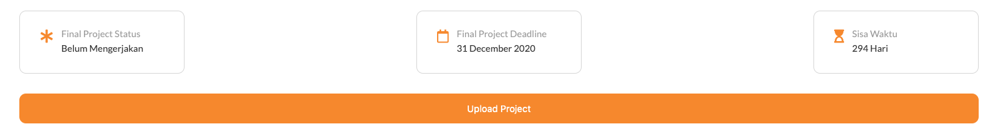

# Web Apps Project 3

## Projects Concepts

### Approaching a Project

Perencanaan yang baik akan menghasilkan output yang baik pula. Berikut adalah beberapa langkah yang patut diterapkan, saat mengerjakan sebuah projek.

- Gambaran langkah-langkah yang diperlukan
- Visualisasikan aplikasi yang ingin kamu buat dalam bentuk gambar
  - Seperti apa page yang ingin kamu buat
  - Bagaimana transisi antar page yang ingin kamu kembangkan
- Kembangkan page secara sistematis, elemen demi elemen

Sebelum kamu submit projek:

- Usahakan hilangkan semua bugs
- Periksa kembali rubric dan pastikan projek kamu sesuai dengan kriteria

Lakukan dengan santai, serta kolaborasikan kemampuan yang baru kamu dapatkan! 🙌🏼

Jika kamu mengalami kendala, jangan ragu untuk menggunakan **mentor service**.

### Project Overview

Pada projek _Fitness Companion_ _Apps_.

1. Kamu akan membuat sebuah **aplikasi yang dapat mengatur workout harian**

2. **Menampilkan detail workout berdasarkan card yang tersedia**

3. Projek ini menitikberatkan **penggunaan Vue untuk memaintain aspek frontend dan Express untuk memaintain aspek backend** nya

#### Starting from Scratch

**Kerjakan semuanya dari 0, kamu bisa mulai dengan membuat server menggunakan express.js kemudian membuat project vue menggunakan vue CLI (recomended) atau CDN, serta menambahkan CSS dan JavaScript yang dibutuhkan.**

Kamu juga bisa menggunakan CSS framework seperti bootstrap untuk mempercantik tampilannya. Namun untuk bootsrap di vue menggunakan [vue boostrap component](https://bootstrap-vue.js.org/), berbeda dengan framework CSS bootstrap biasa.

Berikut adalah beberapa pilihan CSS framework untuk vue.js yang bisa digunakan:

- [Vuetify](https://vuetifyjs.com/en/)
- [Vue Bootstrap](https://bootstrap-vue.js.org/)
- [Vue Material](https://vuematerial.io/)
- [Vue Semantic UI](https://semantic-ui-vue.github.io/#/)
- [Vue Tailwind](https://vue-tailwind.com/)
- [Buefy](https://buefy.org/)

#### App Functionality

Dalam aplikasi ini, main page akan:

1. Menampilkan 2 card atau button untuk menuju ke Personal Workout dan Heroes Workout.

   Contohnya bisa dilihat seperti gambar di bawah ini:

   

   - **Personal Workout** adalah list workout yang diperuntukkan untuk user personal.

   - Sedangkan **Heroes Workout** adalah rangkaian workout yang tersedia dengan nama-nama superhero \(seperti Batman Workout yang berisikan: 20 squats, 40 punches, etc\).

2. Saat user mengakses **Personal Workout**, user mendapatkan tampilan seperti berikut:

   

   - User mendapatkan **daftar personal workout** yang data JSON-nya diambil dari backend menggunakan axios atau fetch API dan **checkbox pada setiap workout yang dapat di-checklist ketika workout sudah dikerjakan**.

3. Ketika user mengakses **Heroes Workout (Hero Workout)**, user mendapatkan tampilan seperti berikut:

   

   - **\*Melihat daftar workouts yang sudah diatur (Heroes) dengan data berupa JSON yang diambil dari backend menggunakan axios atau fetch API**.

   - Setiap workout **berisikan gambar, judul workout, dan button "details"**.

   - Workout boleh berbentuk **modal** atau **page** (pilih salah satu)

   Ketika button details diklik, dan memunculkan **modal:**

   

   Ketika button details diklik, dan memunculkan **page:**

   

4. Halaman Heroes Workout juga memiliki **search form**, di mana search form ini berguna untuk mencari Heroes Workout tertentu dan melihat detailnya, seperti gambar di bawah ini:

   

   - Search form tersebut memiliki **text input yang dapat digunakan untuk langsung mem-filter workout**. Saat value yang ada pada text input berubah, workout yang cocok dengan inputan tersebut akan muncul.

#### Submission Requirements

Submission yang kamu ajukan harus berisikan semua file yang diperlukan, untuk menjalankan aplikasi web yang kamu buat pada sebuah browser. Reviewer akan menilai submission kamu, jika sudah sesuai dengan persyaratan.

#### Considerations

Fokus pada projek ini adalah penggunaan Vue dan Nodejs nya, jadi estetika proyek yang kamu buat bukan prioritas. Silahkan percantik layout HTML dan CSS jika kamu mau, namun **inti dari proyek ini adalah fungsionalitas**.

### Project Instructions & Rubric

#### How will this project be evaluated

Proyek kamu akan dievaluasi oleh Hacktiv8 _Online Code Reviewer_, sesuai dengan rubrik. Periksa kembali proyek kamu sebelum disubmit. Semua kriteria harus sesuai dengan standar yang ditentukan agar dapat diterima.

> Rubrik proyek adalah satu-satunya sumber materi untuk membuat projek. Jangan lupa untuk menyimpannya ke bookmark browser sehingga dapat diakses dengan mudah.

#### Submission Instructions

Kamu harus:

- **Upload zip file kamu ke Hacktiv8 _Online Program Projek submission_** dengan **mengklik button upload project** seperti di bawah ini:

