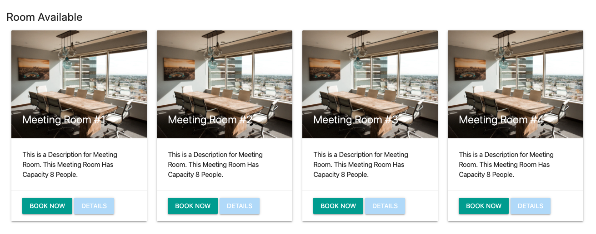

# Web Apps Project 5 // Room Booking Apps

## Projects Concepts

### Approaching a Project

Perencanaan yang baik akan menghasilkan output yang baik pula. Berikut adalah beberapa langkah yang patut diterapkan, saat  mengerjakan sebuah projek.

* Gambaran langkah-langkah yang diperlukan
* Visualisasikan aplikasi yang ingin kamu buat dalam bentuk gambar
  * Seperti apa page yang ingin kamu buat
  * Bagaimana transisi antar page yang ingin kamu kembangkan
* Kembangkan page secara sistematis, elemen demi elemen

Sebelum kamu submit projek:

* Usahakan hilangkan semua bugs
* Periksa kembali rubric dan pastikan projek kamu sesuai dengan kriteria

Lakukan dengan santai, serta kolaborasikan kemampuan yang baru kamu dapatkan! 🙌🏼

Jika kamu mengalami kendala, jangan ragu untuk menggunakan **mentor service**.

### Project Overview

Pada proyek _Room Booking Apps_ ini, kamu akan:

1. Membuat sebuah aplikasi yang dapat membantumu untuk memantau semua ruang konferensi atau meeting
2. Mencari dengan filter dan memilih ruangan yang ingin kamu book pada tanggal dan waktu tertentu.
3. Proyek ini menitikberatkan seluruh materi yang ada

#### Get the Project

Ada beberapa opsi untuk memulai projek ini, yaitu:

* forking dan cloning repository yang disedikan di Git (TBA)
* mulai dari 0 dengan membuat file sendiri

#### Starter Code

Jika kamu lebih suka menggunakan laptop pribadi, silahkan lakukan forking dan cloning starter repository.

**Kode yang terdapat dalam starter repository memiliki CSS dan markup HTML yang bisa digunakan, namun belum ada kode JS**. Cara ini dapat dimanfaatkan untuk menyelesaikan projek, jika kamu tidak mau membuat keseluruhan CSS dan HTML dari 0, maka cara ini dapat mempersingkat waktu. Kode yang tersedia akan mendemonstrasikan sebuah halaman HTML statis dari aplikasi yang kamu buat. Sebagai catatan, page tersebut tidak dapat mendemonstrasikan fungsi secara interaktif.

Kamu juga bisa menggunakan css framework seperti bootstrap untuk mempercantik tampilannya.

#### Starting from Scratch

**Jika kamu memilih untuk mengerjakan semuanya dari 0, kamu bisa mulai dengan membuat sendiri file index.html hingga file CSS dan JavaScript yang dibutuhkan.**

Kamu juga bisa menggunakan css framework seperti bootstrap untuk mempercantik tampilannya.

#### Submission Requirements

Submission yang kamu ajukan harus berisikan semua file yang diperlukan, untuk menjalankan aplikasi web yang kamu buat pada sebuah browser. Reviewer akan menilai submission kamu, jika sudah sesuai dengan persyaratan.

#### Considerations

Fokus pada projek ini adalah penggunaan Vue dan Nodejs nya, jadi estetika proyek yang kamu buat bukan prioritas. Silahkan percantik layout HTML dan CSS jika kamu mau, namun **inti dari proyek ini adalah fungsionalitas**.

### Project Instructions & Rubric

#### How will this project be evaluated

Proyek kamu akan dievaluasi oleh Hacktiv8 Online Code Reviewer, sesuai dengan rubrik. Periksa kembali proyek kamu sebelum disubmit. Semua kriteria harus sesuai dengan standar yang ditentukan agar dapat diterima.

Rubrik proyek adalah satu-satunya sumber materi untuk membuat projek. Jangan lupa untuk menyimpannya ke bookmark browser sehingga dapat diakses dengan mudah.

#### Submission Instructions

Jika kamu memilih untuk menggunakan laptop/komputer pribadi, kamu harus:

Upload zip file kamu ke Hacktiv8 Online Program Projek submission.

### User Story

User story adalah deskripsi yang menjelaskan fungsi-fungsi yang terdapat dalam aplikasi. Untuk melengkapi proyek ini, kamu harus membangun sebuah aplikasi yang meliputi semua fungsionalitas dari user story di bawah ini.

**All Members (semua yang bisa mengakses aplikasi, termasuk admin)**
**User Story \# 1** - Untuk **menghindari input ‘my login detail’ terus-menerus**, sebagai **Staff Member**, saya ingin aplikasi ini:

* Memiliki **fitur ‘Remember Me’**.

**User Story \# 2 -** Untuk mengetahui **ketersediaan room pada tanggal tertentu**, **sebagai Member**, saya mau aplikasi ini:

* **Memilih tanggal** dan **melihat overview dari semua room yang tersedia dan tanggal kosong dari room tersebut**.

**User Story \# 3 -** Untuk mengetahui **ruangan yang memiliki proyektor**, **sebagai Member**, saya ingin aplikasi ini:

* Bisa **mem-filter room yang tidak memiliki proyektor**.

**User Story \# 4 -** Untuk **melihat semua aset yang dimiliki sebuah ruangan**, sebagai **Staff Member**, saya mau:

* **Melihat daftar semua aset di semua ruangan**.

**User Story \# 5 -** Untuk mengetahui **siapa yang sudah memesan room** tertentu, saya mau aplikasi ini:

* Bisa melihat **siapa** yang memesan room tersebut.

**User Story \# 6 -** Untuk **melihat pemesanan room selanjutnya**, sebagai **Staff Member**, Saya mau aplikasi ini:

* Bisa **memilih tanggal dengan kalender**, maupun mencari tanggal tertentu.

**User Story \# 7 -** Untuk **melihat jumlah bangku pada sebuah ruangan**, sebagai **Staff Member**, Saya mau aplikasi ini:

* Dapat menginformasikan **kapasitas** sebuah room.

**Admin**
**User Story \# 1 -** Untuk **membuat Admin baru**, Saya mau aplikasi ini:

* Bisa **menambah** dan/atau menyetujui akun **Admin baru**.

**User Story \# 2 -** Untuk **mengizinkan akses penuh ke aplikasi**, sebagai **Admin**, Saya mau aplikasi ini:

* Dapat **menambah** dan/atau menyetujui akun **User yang dipilih**.

**User Story \# 3 -** Untuk mengikuti **perkembangan perusahaan**, sebagai **Admin**, saya mau aplikasi ini:

* Dapat **menambah gedung, lantai, room, serta aset**.

**Apps**
**User Story \# 1 -** My Room Booking **harus memiliki:**

1. **Halaman login**
2. **Halaman register untuk Member user baru**.

**User Story \# 2 -** My Room Booking **harus memiliki:**

1. Navbar dengan ID ‘navbar’.
2. Navbar tersebut berisikan:
    * Homepage
    * Status booking untuk member
    * Serta tombol Logout

    Contoh navbarnya adalah seperti berikut: 

**User Story \# 3 -** Navbar harus **selalu berada di bagian atas website**.

**User Story \# 4 -** My Room Booking harus memiliki:

* Search form yang berisikan:
    1. Tanggal dan waktu
    2. Kapasitas room
    3. Aset room

    Contoh search formnya sebagai berikut: 

**User Story \# 5 -** Bagian **search result** dari My Room Booking ini harus memiliki:

* **Daftar ruangan**, di mana daftar ruangan ini menggunakan `class="card-deck"` untuk menampung hasil pencarian.

    Contoh tampilan daftar ruangannya adalah sebagai berikut: 

**User Story \# 6 -** **Setiap room ditampilkan dengan card**. Pada bagian **card Body** harus berisikan:

1. **Nama room** dalam `class="card-title"`
2. **Deskripsi room** dan **daftar aset** pada `class="card-text"`
3. **Bagian `class="card-footer"`** harus memiliki **tombol Book**

**User Story \# 7 -** My Room Booking harus memiliki:

* Database dengan nama `H8_Room_Booking`

**User Story \# 8 -** `H8_Room_Booking` harus memiliki **3 tabel**. 

1. **Tabel `users`** untuk **data user** yang memiliki kolom:
    * user_id
    * username
    * password
    * role
2. **Tabel `rooms`** untuk **data room** yang memiliki kolom:
    * room_id
    * name
    * description
    * capacity
    * assets
3. **Tabel `booking`** untuk **booking data** yang memiliki kolom:
    * user_id
    * date and time
    * room_id

**User Story \# 9 -** Peran Admin My Room Booking adalah:

1. Membuat (create)
2. Meng-update (update)
3. Menghapus room, serta detail room (delete).

### Projects Submission

#### Instructions

Periksa kembali apakah proyek kamu sudah mengikuti _style guideline_ kami terkait HTML, CSS, JavaScript dan Git.

Jika kamu memilih untuk menggunakan laptop/pc pribadi:

* Push proyek kamu ke GitHub dan pastikan yang kamu push adalah master branch.
* Pada halaman project submission, pilih "Submit with GitHub"
* Tentukan repository untuk proyek ini \(kemungkinan kamu perlu menghubungkan akun GitHub terlebih dulu\).

#### Project Submission Checklist

Sebelum submit proyek kamu, cek ulang dan pastikan hal-hal berikut ini:

* Saya yakin semua item di rubrik sudah saya lakukan dan proyek saya sudah memenuhi syarat. \(Jika belum, saya akan mendiskusikan hal ini dengan mentor sebelum submit\).
* Proyek dapat dijalankan tanpa _error_ dan aplikasi dapat dijalankan.
* Semua fitur yang diharapkan sudah dikerjakan dan proyek saya sudah berjalan sesuai ekspektasi sebagaimana tertera di spesifikasi proyek.

Jika semua hal di atas terpenuhi, proyek kamu sudah bisa di-submit.

### Project Rubric

| Application Setup |  |
| :--- | :--- |
| CRITERIA | SPECIFICATIONS |
| Apakah aplikasi ini mudah di-install? | Aplikasi dapat di-install dengan mudah dengan `npm install`. |
| Apakah aplikasi memiliki README dengan panduan instalasi dan penggunaan yang jelas? | README yang ter-update sudah termasuk pada aplikasi ini, di mana README ini menjelaskan proyek, serta memberikan instruksi untuk me-maintain dan memodifikasi proyek. |

| Main Page |  |
| :--- | :--- |
| CRITERIA | SPECIFICATIONS |
| Apakah main page memiliki Navbar? | Ya, Navbar tersebut berisikan navigation link ke home, booking dan tombol Logout. |
| Apakah main page memiliki search form? | Ya, search form berisikan waktu & tanggal, kapasitas room, dan aset room. |
| Apakah main page menampilkan room yang tersedia? | Ya, main page menampilkan room yang tersedia berdasarkan hasil search. |

| Admin Page |  |
| :--- | :--- |
| Apakah admin dapat mengakses halaman admin? | Semua admin bisa mengakses halaman tersebut. User selain akses tidak mendapatkan akses. |
| Apakah admin dapat menambah room baru? | Ya, admin dapat menambahkan room baru beserta detailnya. |
| Apakah admin dapat menghapus room? | Ya, admin dapat menghapus room yang tersedia. |
| Apakah admin dapat memperbaharui room? | Ya, admin dapat memperbaharui room. |
| Apakah admin dapat menambah user baru? | Ya, admin dapat menambah user baru beserta informasi yang diperlukan. |
| Apakah admin dapat menghapus user? | Ya, admin dapat menghapus user yang sudah terdaftar. |
| Apakah admin dapat memperbaharui status user? | Ya, admin dapat memperbaharui status user. |

| Database |  |
| :--- | :--- |
| CRITERIA | SPECIFICATIONS |
| Apakah database dapat menyimpan data yang diperlukan? | Ya, database dapat menyimpan data user, data room, dan data booking. Setiap data akan disimpan di tabel berbeda. |
| Apakah tabel user dapat menyimpan data yang diperlukan? | Ya, tabel user dapat menyimpan user\_id data, username, password, dan role. |
| Apakah tabel room dapat menyimpan data yang diperlukan? | Ya, tabel room dapat menyimpan room\_id data, name, description, capacity, dan asset. |
| Apakah tabel booking dapat menyimpan data yang diperlukan? | Ya, tabel booking dapat menyimpan dapat user\_id data, date & time, dan room\_id. |

| Code Functionality |  |
| :--- | :--- |
| CRITERIA | SPECIFICATIONS |
| Apakah user bisa melakukan booking room? | Ya, user bisa booking room apapun yang tersedia. Jika sebuah room sudah di-book pada tanggal dan waktu tertentu, maka user lain tidak dapat booking room tersebut. |
| Apakah komunikasi REST API aman? | Ya, endpoint di setiap komunikasi menggunakan verified token. |
| Apakah kode yang ada berjalan tanpa _error_? | Kode dapat berjalan mulus tanpa _error_. Juga tidak ada _warning_ yang disebabkan oleh salah satunya tidak mengikuti standar penulisan atau _best practices_. Pastikan semua kode dapat berfungsi dengan baik dan rapi. |
